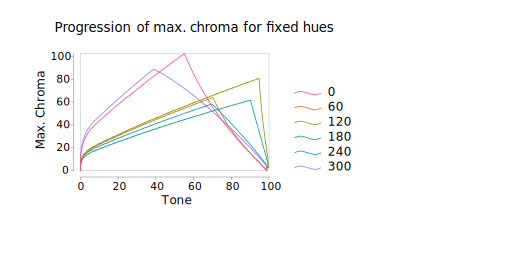

 

<picture>
    <source media="(prefers-color-scheme: dark)" srcset="https://raw.githubusercontent.com/nvlang/egal/main/res/logotype-dark.svg">
    <source media="(prefers-color-scheme: light)" srcset="https://raw.githubusercontent.com/nvlang/egal/main/res/logotype-light.svg">
    
</picture>
 
 

<!--
[
<picture>
    <source media="(prefers-color-scheme: dark)" srcset="https://img.shields.io/github/v/tag/nvlang/egal?style=flat-square&logo=GitHub&logoColor=a3acb7&label=&labelColor=21262d&color=21262d">
    <source media="(prefers-color-scheme: light)" srcset="https://img.shields.io/github/v/tag/nvlang/egal?style=flat-square&logo=GitHub&logoColor=24292f&label=&labelColor=eaeef2&color=eaeef2">
    
</picture>
](https://github.com/nvlang/egal)
[
<picture>
    <source media="(prefers-color-scheme: dark)" srcset="https://img.shields.io/badge/@nvl/egal-_?style=flat-square&logo=npm&logoColor=a3acb7&labelColor=21262d&color=21262d&logoSize=auto)">
    <source media="(prefers-color-scheme: light)" srcset="https://img.shields.io/badge/@nvl/egal-_?style=flat-square&logo=npm&logoColor=24292f&labelColor=eaeef2&color=eaeef2&logoSize=auto)">
    
</picture>
](https://npmjs.com/@nvl/egal)
[
<picture>
    <source media="(prefers-color-scheme: dark)" srcset="https://img.shields.io/badge/@nvl/egal-_?style=flat-square&labelColor=21262d&color=21262d&logo=jsr&logoColor=a3acb7&logoSize=auto">
    <source media="(prefers-color-scheme: light)" srcset="https://img.shields.io/badge/@nvl/egal-_?style=flat-square&labelColor=eaeef2&color=eaeef2&logo=jsr&logoColor=24292f&logoSize=auto">
    
</picture>
](https://jsr.io/@nvl/egal)
[
<picture>
    <source media="(prefers-color-scheme: dark)" srcset="https://jsr.io/badges/@nvl/egal/score?style=flat-square&labelColor=21262d&color=21262d&logoColor=a3acb7">
    <source media="(prefers-color-scheme: light)" srcset="https://jsr.io/badges/@nvl/egal/score?style=flat-square&labelColor=eaeef2&color=eaeef2&logoColor=24292f">
    
</picture>
](https://jsr.io/@nvl/egal)
[
<picture>
    <source media="(prefers-color-scheme: dark)" srcset="https://img.shields.io/codecov/c/github/nvlang/egal?style=flat-square&logo=codecov&label=&logoColor=a3acb7&labelColor=21262d&color=21262d">
    <source media="(prefers-color-scheme: light)" srcset="https://img.shields.io/codecov/c/github/nvlang/egal?style=flat-square&logo=codecov&label=&logoColor=24292f&labelColor=eaeef2&color=eaeef2">
    
</picture>
](https://codecov.io/gh/nvlang/egal) -->

> [!WARNING]
> This project is under active development, and not yet ready for pretty much any usage.

## Why?

There are many great color systems out there: from classic spot color systems like [PANTONE](https://en.wikipedia.org/wiki/Pantone), [RAL](https://en.wikipedia.org/wiki/RAL_colour_standard), or [ANPA](https://en.wikipedia.org/w/index.php?title=Spot_color&oldid=1180172085#Classification), to widespread digital systems like [X11](https://en.wikipedia.org/wiki/X11_color_names) and [web colors](https://en.wikipedia.org/wiki/Web_colors), to those found in specialized design systems like [Adobe Spectrum](https://spectrum.adobe.com/page/color-palette/), [Apple HIG](https://developer.apple.com/design/human-interface-guidelines/color), [Microsoft FluentUI](https://developer.microsoft.com/fluentui#/styles/web/colors/theme-slots), [TailwindCSS](https://tailwindcss.com/docs/customizing-colors), [IBM Carbon](https://carbondesignsystem.com/guidelines/color/tokens), [VMware Clarity](https://clarity.design/documentation/color), [Google Material](https://m3.material.io/styles/color/the-color-system/tokens), [Github Primer](https://primer.style/foundations/color), etc. So, why another color system?

The answer aligns mostly with the motivation behind Google's [HCT color space](https://material.io/blog/science-of-color-design): perceptual uniformity. In particular, it's rare for a color system to be truly uniform across hues in perceived brightness or saturation, let alone both. The HCT color space alleviates this issue, but as far as I'm aware, there is no simple way to generate a comprehensive color palette with HCT that is perceptually uniform in both brightness and saturation. Google's [material color utilities](https://github.com/material-foundation/material-color-utilities) provide some built-in ways to generate palettes, but are limited to tonal uniformity, and are relatively inflexible.

What this project aims to do is to build on Google's material color utilities to provide a simple, flexible, and comprehensive way to generate color palettes that are perceptually uniform in both brightness and saturation.

<picture>
  <source media="(prefers-color-scheme: dark)" srcset="assets/graphics/graph.svg">
  <source media="(prefers-color-scheme: light)" srcset="assets/graphics/graph.svg">
  
</picture>

## Other Resources

### Software

-   [ColorAide](https://github.com/facelessuser/coloraide): Object-oriented color manipulation library written purely in Python.
-   [HCT Color Converter](https://www.hct-color-converter.com): Online HCT color converter.
-   [HCT Color Picker](https://www.figma.com/community/plugin/1227923985322908257/hct-color-picker): Figma plugin for picking colors in the HCT color space.
-   [Material Color Utilities](https://github.com/material-foundation/material-color-utilities): Google's color libraries for Material Design.

### Articles

-   [Color Appearance Model](https://en.wikipedia.org/wiki/Color_appearance_model): Wikipedia article on color appearance models.
-   [The Science of Color & Design](https://material.io/blog/science-of-color-design): Google's blog post on the HCT color space.

### Discussions

-   [HCT Color Space](https://news.ycombinator.com/item?id=37308278): Hacker News discussion on the HCT color space, involving its creator.
