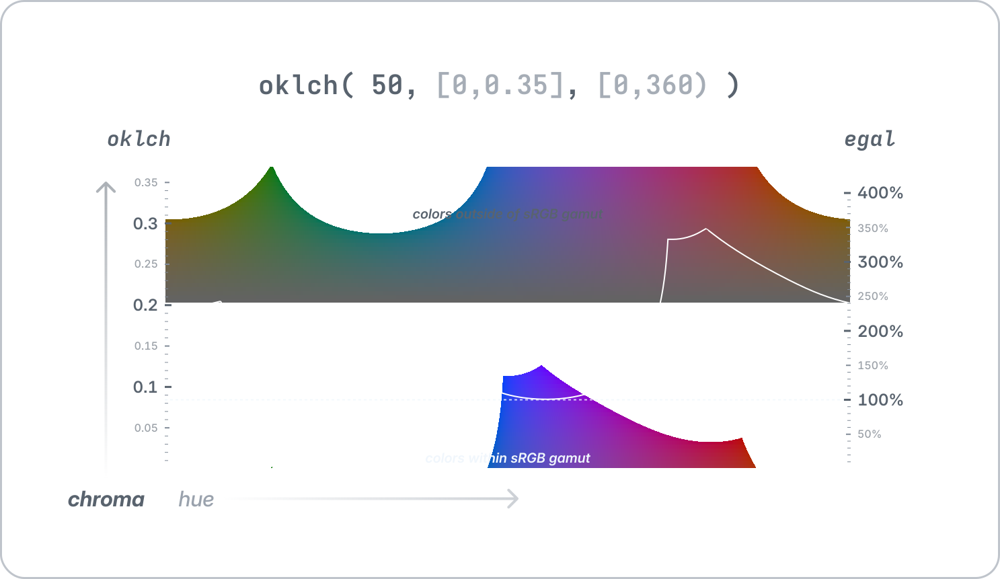
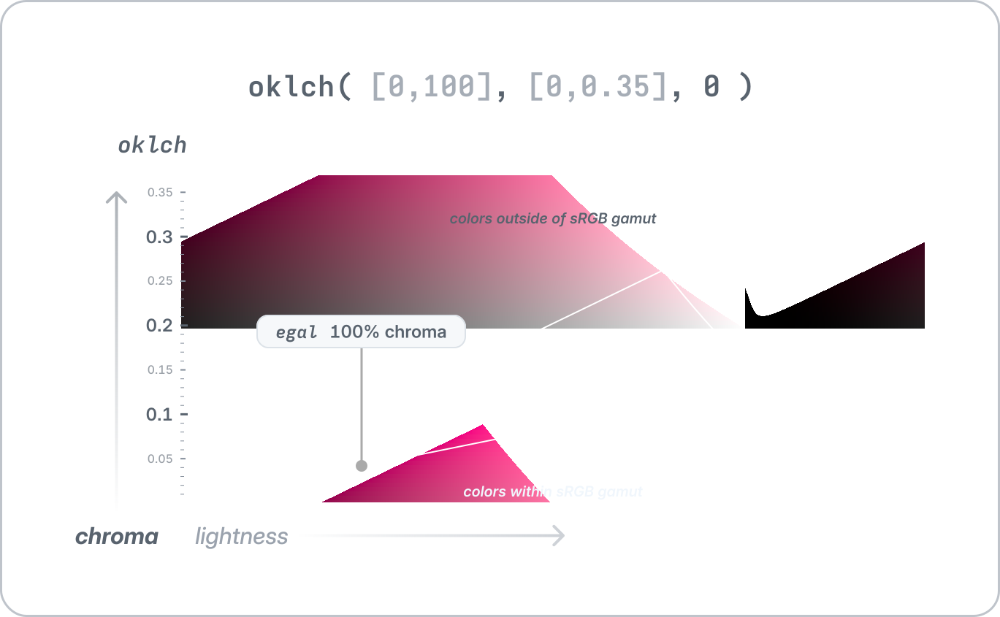

 

<picture>
    <source media="(prefers-color-scheme: dark)" srcset="https://raw.githubusercontent.com/nvlang/egal/main/res/logotype-dark.svg">
    <source media="(prefers-color-scheme: light)" srcset="https://raw.githubusercontent.com/nvlang/egal/main/res/logotype-light.svg">
    
</picture>
 
 

[
<picture>
    <source media="(prefers-color-scheme: dark)" srcset="https://img.shields.io/github/v/tag/nvlang/egal?style=flat-square&logo=GitHub&logoColor=a3acb7&label=&labelColor=21262d&color=21262d&filter=@nvl/egal@*">
    <source media="(prefers-color-scheme: light)" srcset="https://img.shields.io/github/v/tag/nvlang/egal?style=flat-square&logo=GitHub&logoColor=24292f&label=&labelColor=eaeef2&color=eaeef2&filter=@nvl/egal@*">
    
</picture>
](https://github.com/nvlang/egal)
[
<picture>
    <source media="(prefers-color-scheme: dark)" srcset="https://img.shields.io/badge/@nvl/egal-_?style=flat-square&logo=npm&logoColor=a3acb7&labelColor=21262d&color=21262d&logoSize=auto)">
    <source media="(prefers-color-scheme: light)" srcset="https://img.shields.io/badge/@nvl/egal-_?style=flat-square&logo=npm&logoColor=24292f&labelColor=eaeef2&color=eaeef2&logoSize=auto)">
    
</picture>
](https://npmjs.com/@nvl/egal)
[
<picture>
    <source media="(prefers-color-scheme: dark)" srcset="https://img.shields.io/badge/@nvl/egal-_?style=flat-square&labelColor=21262d&color=21262d&logo=jsr&logoColor=a3acb7&logoSize=auto">
    <source media="(prefers-color-scheme: light)" srcset="https://img.shields.io/badge/@nvl/egal-_?style=flat-square&labelColor=eaeef2&color=eaeef2&logo=jsr&logoColor=24292f&logoSize=auto">
    
</picture>
](https://jsr.io/@nvl/egal)
[
<picture>
    <source media="(prefers-color-scheme: dark)" srcset="https://jsr.io/badges/@nvl/egal/score?style=flat-square&labelColor=21262d&color=21262d&logoColor=a3acb7">
    <source media="(prefers-color-scheme: light)" srcset="https://jsr.io/badges/@nvl/egal/score?style=flat-square&labelColor=eaeef2&color=eaeef2&logoColor=24292f">
    
</picture>
](https://jsr.io/@nvl/egal)
[
<picture>
    <source media="(prefers-color-scheme: dark)" srcset="https://img.shields.io/codecov/c/github/nvlang/egal?flag=egal&style=flat-square&logo=codecov&label=&logoColor=a3acb7&labelColor=21262d&color=21262d">
    <source media="(prefers-color-scheme: light)" srcset="https://img.shields.io/codecov/c/github/nvlang/egal?flag=egal&style=flat-square&logo=codecov&label=&logoColor=24292f&labelColor=eaeef2&color=eaeef2">
    
</picture>
](https://codecov.io/gh/nvlang/egal)

 

> [!NOTE]
> **Getting started**: Refer to the README of the
> [standalone package](./packages/egal/README.md#getting-started) or
> [PostCSS plugin](./packages/postcss-egal/README.md#getting-started),
> depending on your use case.

## Why?

### Problem

Color spaces like OkLCh and HCT aim to be perceptually uniform, and they can be
incredibly useful if consistency of lightness across hues is important. However,
it can be difficult to ensure consistency of chromaticity (saturation) across
hues. This is because not all hues can deliver the same chromaticity at a given
lightness.

For example, if you take the color `oklch(50% 0.275 280)`
, you get a very saturated
purple. However, if you shift the hue to 200, you'll find that an sRGB monitor
cannot truly display the color `oklch(50% 0.275 200)`, and instead will silently
fall back to `oklch(50% 0.0848 200)`
.

### Idea

Now, how can we make colors of different hues but equal lightness appear equally
saturated? One way, of course, is to set the saturation to zero, but this.
Alternatively, one can try to find the largest chromaticity value that all the
different hues can still deliver at the given lightness. That's precisely what
_égal_ (IPA /e.ɡal/ — from French, meaning "equal" or "indifferent") does. It
maps the absolute scale of chromaticity embedded in OkLCh into a scale that is
relative to the aforementioned maximal chromaticity.

 

<picture align="center">
  <source media="(prefers-color-scheme: dark)" srcset="res/oklch-vs-egal-fixed-lightness-dark.svg">
  <source media="(prefers-color-scheme: light)" srcset="res/oklch-vs-egal-fixed-lightness-light.svg">
  
</picture>

 

The tradeoff here is that we lose consistency of chromaticity values across
lightnesses:

 

<picture>
  <source media="(prefers-color-scheme: dark)" srcset="res/oklch-vs-egal-fixed-hue-dark.svg">
  <source media="(prefers-color-scheme: light)" srcset="res/oklch-vs-egal-fixed-hue-light.svg">
  
</picture>

 

However, given that the consistency of chromaticity across lightness was still
vulnerable to being broken by fallbacks arising from the limitations of the sRGB
(or P3, Rec2020, etc.) color gamut, this tradeoff might not be as bas as it
seems, depending on the use case.

### In Detail

As mentioned before, the core idea behind égal is as follows:

> For a given lightness, find the largest chromaticity such that any hue will be
> still able to deliver that chromaticity at the given lightness.

Now, this can be generalized into the following:

> For a given lightness $\ell$, provide a _linear_ mapping
> $f_\ell\colon[0,\infty)\to[0,\infty)$ such that $f_\ell(0) = 0$ and
> $f_\ell(100)$ equals the largest chromaticity such that, at the given lightness,
> any hue will still be able to deliver that chromaticity.

These functions $f_\ell$ are then used to define a mapping into the input space
of OkLCh as follows:

$$
\begin{aligned}
\texttt{egal} &\colon [0,100]\times[0,\infty)\times[0,360) \to [0,100]\times[0,\infty)\times[0,360), \\
\texttt{egal} &\colon \langle \ell, c, h \rangle \mapsto \langle \ell, f_\ell(c), h \rangle.
\end{aligned}
$$

Note that these functions are sensitive to the color gamut that we are
targeting, since the maximum chromaticity values directly depend on that gamut.
This is because the gamut is what specifies when a color is no longer considered
displayable. For example, P3 monitors are able to display more saturated colors
than sRGB monitors, and therefore the maximum chromaticity values for P3 are
larger than those for sRGB. Because of this, the target gamut can be specified
as an option passed to the egal function.

Furthermore, if you prefer to use HCT instead of OkLCh behind the scenes, that's
also supported.

## Other Resources

### Software

-   [ColorAide](https://github.com/facelessuser/coloraide): Object-oriented
    color manipulation library written purely in Python.
-   [HCT Color Converter](https://www.hct-color-converter.com): Online HCT color
    converter.
-   [HCT Color Picker](https://www.figma.com/community/plugin/1227923985322908257/hct-color-picker):
    Figma plugin for picking colors in the HCT color space.
-   [Material Color Utilities](https://github.com/material-foundation/material-color-utilities):
    Google's color libraries for Material Design.

### Articles

-   [Color Appearance Model](https://en.wikipedia.org/wiki/Color_appearance_model):
    Wikipedia article on color appearance models.
-   [The Science of Color & Design](https://material.io/blog/science-of-color-design):
    Google's blog post on the HCT color space.
-   [Exploring Tonal Palettes](https://facelessuser.github.io/coloraide/playground/?notebook=https%3A%2F%2Fgist.githubusercontent.com%2Ffacelessuser%2F0235cb0fecc35c4e06a8195d5e18947b%2Fraw%2F3ca56c388735535de080f1974bfa810f4934adcd%2Fexploring-tonal-palettes.md):
    A Jupyter notebook exploring tonal palettes using the ColorAide library, by
    the author of the library.

### Discussions

-   [HCT Color Space](https://news.ycombinator.com/item?id=37308278): Hacker
    News discussion on the HCT color space, involving its creator.

### Color Systems

-   Spot color systems: [PANTONE](https://en.wikipedia.org/wiki/Pantone),
    [RAL](https://en.wikipedia.org/wiki/RAL_colour_standard),
    [ANPA](https://en.wikipedia.org/w/index.php?title=Spot_color&oldid=1180172085#Classification)
-   Widespread digital color systems:
    [X11](https://en.wikipedia.org/wiki/X11_color_names),
    [web colors](https://en.wikipedia.org/wiki/Web_colors)
-   Specialized color systems: [Adobe Spectrum](https://spectrum.adobe.com/page/color-palette/),
    [Apple HIG](https://developer.apple.com/design/human-interface-guidelines/color),
    [Microsoft FluentUI](https://developer.microsoft.com/fluentui#/styles/web/colors/theme-slots),
    [TailwindCSS](https://tailwindcss.com/docs/customizing-colors),
    [IBM Carbon](https://carbondesignsystem.com/guidelines/color/tokens),
    [VMware Clarity](https://clarity.design/documentation/color),
    [Google Material](https://m3.material.io/styles/color/the-color-system/tokens),
    [Github Primer](https://primer.style/foundations/color), etc.
